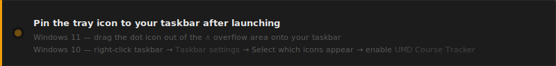

<div align="center">

# UMD Course Tracker

A Windows taskbar tray indicator that monitors UMD Testudo seat availability<br/>and alerts you the moment a seat opens.

<br/>


<br/><br/>

<a href="https://github.com/Yidiiiz/UMD-Course-Tracker/releases/latest/download/UMDCourseTracker.exe">
  
</a>

<sub>Windows 10 & 11 &nbsp;·&nbsp; No installation required &nbsp;·&nbsp; No Python needed</sub>



</div>

<br/>

---

**What it is**

UMD Course Tracker sits in your taskbar as a small colored dot — green when seats are open, red when full. It is designed to be a persistent at-a-glance indicator, not just a background process.

---

**Download and run**

Download `UMDCourseTracker.exe` above and double-click it.

> Windows may show a **"Windows protected your PC"** SmartScreen prompt because the app is not code-signed (certificates cost ~$200/year). Click **More info → Run anyway**. The source code is fully open in this repository.

---

**Add a course**

Left-click the tray icon → enter a course ID (e.g. `CMSC351`) → pick a semester → **+ Add Course**

| Action | How |
|:---|:---|
| Open panel | Left-click the tray icon |
| Remove a course | Hover a card → click **×** |
| Open on Testudo | Click anywhere on a course card |
| Tray icon | 🟢 Seats open · 🔴 Full · 🟡 Checking |

---

**Settings**

Expand **Advanced** at the bottom of the panel.

| Setting | Default |
|:---|:---|
| Poll interval | 60 s (min 30 s) |
| Notify when a section closes | Off |
| Open on Windows startup | On |
| Theme | Follows system dark / light mode |

Data is stored in `%APPDATA%\UMD Course Tracker\` — never next to the `.exe`.

---

**Term Codes**

The app selects the next upcoming semester automatically. You can override it when adding a course.

| Code | Semester |
|:---|:---|
| `202501` | Spring 2025 |
| `202508` | Summer 2025 |
| `202512` | Winter 2026 |
| `202601` | Spring 2026 |
| `202608` | Fall 2026 |

---

**Build from Source**

```bat
git clone https://github.com/Yidiiiz/UMD-Course-Tracker.git
cd "UMD-Course-Tracker\UMDCourseTracker"
setup.bat         :: install dependencies
build.bat         :: produces dist\UMDCourseTracker.exe
python tracker.py :: run from source
```

`requests` · `beautifulsoup4` · `pystray` · `Pillow` · `plyer` · `pyinstaller`
