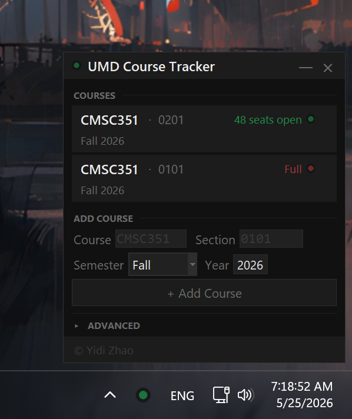

<div align="center">



<br/>

[](https://github.com/Yidiiiz/UMD-Course-Tracker/releases/latest/download/UMDCourseTracker.exe)

*No installation · No Python · Windows 10 & 11*

</div>

<br/>

---

### Getting Started

**1 — Download and run**

Click the button above to download `UMDCourseTracker.exe`, then double-click it to launch. Nothing to install.

**2 — Pin it to your taskbar** *(do this first)*

Windows hides new tray icons in the overflow menu by default — you won't see notifications unless the icon is visible.

- **Windows 11** — drag the 🟡 icon out of the `^` overflow area onto your taskbar
- **Windows 10** — right-click the taskbar → *Taskbar settings* → *Select which icons appear on the taskbar* → enable **UMD Course Tracker**

**3 — Add your courses**

Left-click the tray icon → enter a course ID (e.g. `CMSC351`) → pick a semester → **+ Add Course**

---

### How It Works

| Tray color | Meaning |
|:---|:---|
| 🟢 Green | At least one seat is open |
| 🔴 Red | All sections full |
| 🟡 Yellow | Checking / paused / error |

The app polls Testudo every 60 seconds. The moment a closed section flips open, a Windows notification fires and clicking it opens the course page in your browser.

---

### Settings

Open the panel and expand **Advanced** at the bottom:

| Setting | Default |
|:---|:---|
| Poll interval | 60 s (min 30 s) |
| Notify when a section closes | Off |
| Open on Windows startup | On |
| Theme | Follows system dark / light mode |

Your course list and settings are stored in `%APPDATA%\UMD Course Tracker\` — never next to the `.exe`.

---

### Term Codes

The app picks the next upcoming semester automatically. You can override it when adding a course.

| Code | Semester |
|:---|:---|
| `202501` | Spring 2025 |
| `202508` | Summer 2025 |
| `202512` | Winter 2026 |
| `202601` | Spring 2026 |
| `202608` | Fall 2026 |

---

### Build from Source

```bat
git clone https://github.com/Yidiiiz/UMD-Course-Tracker.git
cd UMD-Course-Tracker
setup.bat         :: install dependencies
build.bat         :: produces dist\UMDCourseTracker.exe
python src\tracker.py  :: run from source
```

Dependencies: `requests` · `beautifulsoup4` · `pystray` · `Pillow` · `plyer` · `pyinstaller`
